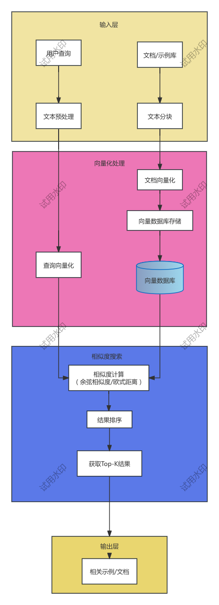

# deepseek 模型区别

| 对比项               | DeepSeek Chat            | DeepSeek Reasoner            |
|-------------------|--------------------------|------------------------------|
| **模型定位**          | 通用对话与指令执行                | 强逻辑推理与多步任务求解                 |
| **主要用途**          | 问答、内容生成、翻译、总结、指令跟随       | 数学推理、因果分析、算法题解、多轮推理任务        |
| **训练侧重**          | 自然语言交互、RLHF、SFT          | 思维链（CoT）、工具使用、逻辑训练、长链推理      |
| **是否支持工具调用**      | ❌ 不支持或弱集成                | ✅ 支持工具/函数调用机制                |
| **推理能力**          | ⭐⭐⭐（一般）                  | ⭐⭐⭐⭐⭐（强）                     |
| **典型场景**          | 日常 AI 助手、总结文案、生成文本       | 解数学题、代码推理、多轮对话中保持逻辑一致性       |
| **适合构建 AI Agent** | ✅ 可以用于基础任务               | ✅✅ 更适合复杂 Agent 推理任务          |
| **示例对话**          | “请写一段春天的作文” → 输出结构清晰优美文章 | “3个贴错标签的箱子如何判断” → 输出详细逻辑步骤推理 |

> ✅ 总结：**DeepSeek Chat** 擅长自然语言对话与通用任务，**Reasoner** 擅长逻辑严谨的推理与复杂问题求解。
> 相比较而言，Reasoner 比 Chat 更加消耗token， 返回结果中 Reasoner 包含推理逻辑（additional_kwargs['reasoning_content']
> ），而Chat里面没有

# LangChain 标准参数、事件、与输入输出

## 标准事件

- **invoke**: 模型主要调用方法，输入list，输出list
- **stream**: 流式输出方法
- **batch**: 批量模型请求方法
- **bind_tools**: 在模型执行的时候绑定工具
- **with_structured_output**: 基于invoke的结构化输出

## 其他有用的事件

- **ainvoke**: 异步调用模型的方法
- **astream**: 异步流式输出
- **abatch**: 异步的批量处理
- **astream_events**: 异步流事件
- **with_retry**：调用失败时重试
- **with_fallback**: 失败恢复事件
- **configurble_fields**: 模型运行时的运行参数

# python 虚拟环境

## 设置虚拟环境
```bash
python3 -m venv .venv
```

## 导出依赖
```bash
pip3 freeze > requirements.txt
```

### 退出虚拟环境
```bash
deactivate
```

### 安装 requirements.txt 中的依赖包
```bash
pip3 install -r requirements.txt
```

### 安装pipreqs  
> pipreqs 是一个非常实用的工具，它可以根据你的项目代码，自动生成一个 requirements.txt 文件，只包含你实际使用到的 Python 包（而不是像 pip freeze 一样列出整个虚拟环境中的所有包）。

#### 安装
```bash
pip3 install pipreqs
```

#### 基本用法
> 在项目根目录下运行
```bash
pipreqs .
```

#### 常用参数

| 参数    | 用说明 |
|-------|--------------------------|
| --force | 强制覆盖已存在的 requirements.txt 文件 |
| --encoding utf-8 | 指定文件编码，避免编码错误 |
| --ignore <dir> | 忽略某些目录（如 venv, tests）|
| --savepath <path> | 指定 requirements.txt 保存路径 |
| --proxy <proxy> | 使用代理连接 PyPI 以查询依赖版本

示例：
```bash
pipreqs . --force --encoding=utf-8 --ignore tests,venv
```

#### pipreqs vs pip freeze 对比

| 比较项   | pipreqs        | pip freeze    | 
|-------|----------------|---------------|
| 作用    | 只列出项目中实际用到的库   | 列出虚拟环境中安装的所有库 | 
| 用途    | 更适合开源项目或最小依赖清单 | 更适合部署时完整还原环境  | 
| 是否含未使用包 | ❌ 不含           | ✅ 全部包含        |

#### 注意事项
> 1. pipreqs 依赖源文件中的 import 语句，不会识别动态导入。 
> 2. 如果你用的是模块别名（如 import numpy as np），它也能识别。


## 标准参数、事件与输入输出

### LangChain Message

#### SystemMessage: 系统角色
#### HumanMessage: 用户角色
#### AIMessage: 应用助理角色

| 属性                | 标准化  | 描述                             | 
|-------------------|------|--------------------------------|
| content           | 原生   | 通常为字符串，但也可以是内容块列表              | 
| Tool_call         | 标准化  | 与消息相关的工具调用                     | 
| Invalid_tool_call | 标准化  | 工具调用与消息相关的解析错误                 |
| usage_metadata    | 标准化  | 元数据（输入输出token数，总计token数等）      |
| id                | 标准化  | 消息唯一标识符                        |
| response_metadata | 原生  | 相应元数据（响应头、token计数）             |
> ⚠️注意：不同的大模型提供的内容属性并不相同，目前行业暂无统一标准。
#### AIMessageChunk: 应用助理流式输出
#### ToolMessage: 工具角色
#### RemoveMessage: LangGraph 聊天记录


## 示例选择权使用

### 根据 token 长度控制选择的示例总长度
    根据用户的输入、提示词总长度来动态计算可容纳的示例个数

### 使用向量相似度选择与输入语义最相近的示例
- 筛选示例组中与输入的语义相似度最高的示例
- 本质：将问题语义与示例嵌入向量空间后进行搜索对比
- 依赖：向量数据库


### 使用 MMR（最大边际相关性）算法选择多样性和相关性兼顾的示例
- 筛选示例数组中符合MMR规则的示例
- 本质： 将问题与示例嵌入向量空间后进行搜索对比
- 依赖： 向量数据库
- MMR: MMR（Maximal Marginal Relevance）是一种排序策略，核心思想是：
  - 选择与输入最相关的样本
  - 同时避免样本之间过于相似 → 保证信息多样性

## LangSmith hub 管理提示词


## 什么是Pydiantic
    Pydantic 是一个基于 Python 类型注解（Type Hints） 的数据验证和设置管理库。它广泛应用于 FastAPI、LangChain 等现代 Python 框架中。
    Pydantic 允许你像写类一样定义数据结构，并自动帮你完成数据验证、类型转换和错误提示。

📦 示例：定义一个用户数据模型
```python
from pydantic import BaseModel

class User(BaseModel):
    id: int
    name: str
    email: str

# 自动类型转换 & 校验
user = User(id='123', name='Alice', email='alice@example.com')
print(user.id)  # 自动转换为 int: 123
```

🔧 常见功能

| 功能 | 	示例                  |
| ----|:---------------------|
| 类型强校验 | 自动抛出错误（如字符串传 int 字段） |
| 类型自动转换 | 如 "123" → int(123)   |
| 默认值支持	| 字段可设置默认值             |
| 嵌套对象结构定义	|可以嵌套 BaseModel|
| 校验规则自定义	|自定义 validator 做复杂校验|
| JSON 支持|	可与 dict/JSON 快速互转|
| 更好的错误信息	|报错信息结构化，可用于接口返回|

📚 应用场景

|场景	| 用法                         |
| ----|:---------------------------|
|💡 FastAPI 请求体解析	| 自动把请求体校验为 Pydantic 模型      |
|🧠 LangChain 参数验证	| 验证 Prompt、LLM 配置和链参数       |
|🔒 配置管理	| 使用 BaseSettings 管理 .env 配置 |
|📦 数据建模	| 把 Pydantic 用于数据库模型、缓存结构等   |


⸻

🧠 使用 Pydantic 的好处

|优势|	说明|
| ----|:---------------------|
|✅ 强类型保障	|避免“脏数据”传播，提高代码健壮性|
|✅ 自动数据转换	|少写 if 判断，多用标准数据结构|
|✅ 更好的错误提示	|报错清晰，可追溯具体字段|
|✅ 快速序列化/反序列化|	和 dict、JSON 转换无痛|
|✅ 自动文档生成支持	|FastAPI 可自动生成文档|


🧪 更复杂的校验（示例）
```python
from pydantic import BaseModel, validator

class User(BaseModel):
    name: str
    age: int

    @validator('age')
    def check_age(cls, v):
        if v < 0:
            raise ValueError("年龄不能为负数")
        return v 

```


## LanginChain 中的 chain（链）的高级使用
- 使用 @chain 修饰符快速将函数变为链
- 在链中使用lambda函数
- 在链中自定义支持流输出的函数
- 使用 RunnablePassthrough 在链中传值
- 如果在运行时动态添加链的配置
- 为链增加记忆
- 创建路由链
- 为链添加回退机制。


## yield 和 return 区别
yield 和 return 都是 Python 中的关键字，用于函数返回值，但它们的作用和用法完全不同。下面是它们的详细对比：

🧠 1. 核心区别

| 特性	| return | 	yield          |
| -----|:---------------------|:----------------|
| 函数类型 |	普通函数	生成器函数（Generator）|
|返回值	一次性返回一个值，函数结束 |	返回一个值，保留函数状态，可继续执行|
| 可多次返回	| ❌ 一次后结束	| ✅ 多次通过 yield 返回 |
| 用法场景 |	简单计算，立即返回结果 |	需要延迟执行、大数据、流式处理 |


✅ 示例对比

return 示例：
```python
def get_numbers():
    return [1, 2, 3]

res = get_numbers()
print(res)
# 输出: [1, 2, 3]
```

➡️ 一次性返回整个列表，函数执行完就结束。

yield 示例：
```python
def get_numbers():
    yield 1
    yield 2
    yield 3

for num in get_numbers():
    print(num)
# 输出:
# 1
# 2
# 3
```
➡️ 每次 yield 返回一个值，下一次继续从上次中断的位置执行。


⚙️ yield 原理补充

yield 把函数变成一个生成器（generator）对象，而不是直接执行完所有内容：
```python
def get_numbers():
    yield 1
    yield 2
    yield 3

gen = get_numbers()  # 不执行函数体
print(next(gen))     # 输出 1
print(next(gen))     # 输出 2

```
每次调用 next()，函数执行到下一个 yield，然后暂停，直到下次继续。


📦 实际使用场景

| 场景                   | 	使用推荐   |
|----------------------|:--------|
| 一次性返回全部数据            | 	return |
| 大数据处理/分页读取/懒加载	      | yield   |
| 流式输出，如 LLM token 生成	 | yield   |
|管道式多步处理（如 for chunk in ...)	| yield   |

🔍 总结一句话
- return：一次性返回结果，函数立刻终止 
- yield：每次返回一个值，保留状态，适合流式/惰性处理

## RAG 检索增强生成

RAG（Retrieval-Augmented Generation，检索增强生成）是一种结合 信息检索 与 大语言模型生成能力 的 AI 架构或技术流程，常用于提升模型在专业知识问答、文档摘要、个性化对话等任务中的准确性与可靠性。

🔍 什么是 RAG？

简单来说，RAG 是：

> 先 检索 相关内容，再用大模型 生成 回答的方式。

它的核心流程是：
1. 用户提问 
2. 检索模块（Retrieval）从知识库或文档中找到与问题最相关的内容片段（比如向量搜索） 
3. 生成模块（Generation）使用大模型（如 GPT-4）结合检索到的信息生成答案


🧠 为什么要用 RAG？

大语言模型（LLM）虽然强大，但存在两个问题：
- 知识更新慢（它的知识是训练时固化的） 
- 容易胡编乱造（hallucination）

RAG 解决这些问题的方法是： 
- 通过外部检索提供“实时的、真实的”知识来源 
- 结果作为上下文提供给模型，大大降低“编造答案”的风险

📦 RAG 应用场景举例

| 场景                                   | 	应用                           |
|--------------------------------------|:------------------------------|
| 企业知识库问答                              | 	内部文档、FAQ 查询                  |
| 法律/医疗问答                              | 	基于法律条文、病例、文献提供参考答案           |
| 产品支持	                                | 对接公司手册或数据库，为客户提供智能客服          |
| 私人笔记助手	| 查询 Notion、Obsidian 或本地资料并生成回答 |


🛠️ 技术组成

典型的 RAG 系统包含以下模块：
1.	文档预处理与向量化（Embedding） 
   - 文档分段 + 向量编码，存入向量数据库（如 FAISS、Weaviate、Pinecone）
2.	检索模块
   - 接收用户查询，将其转成向量，与数据库中的内容进行相似度匹配
3.	上下文构建
   - 将检索出的段落与原问题组合成 prompt，输入 LLM
4.	生成模块
   - LLM 输出最终回答，并可标注参考来源（可选）

🧱 举个具体例子：

你问：“公司请假流程是怎样的？”

👉 普通 LLM（如 ChatGPT）如果没训练过你公司的信息，只能给个泛泛的回答。

👉 RAG 模式会去你公司文档库中检索相关段落（如“请假制度.pdf”），找到具体流程，然后模型基于这些内容回答你，精确且可溯源。

### 知识（数据）预处理
> 文档向量化是进行向量搜素的前置条件
1. 加载文档（Load）
2. 分隔文档（Split）
3. 嵌入文档（Emnfd）
4. 存储文档（Store）
#### langChain 中的实现
> 各种文档 -->  各种loader --> 文本splitter（文本切片） --> embedding（向量化） --> 各种vectorstore（向量存储） --> 搜索

##### langChain 中各种loader
> loader 将各种结构化，非结构化数据加载进系统，并最终统一向量化
- Cvsloader
- FileDirctoryLoader
- HTMlLoader
- MarkdownLoader
- JSONLoader
- pdfLoader
- 等等等....
##### 嵌入模型
> 将文本转换为数字向量表示
> 使用简单的数学运算来比较嵌入向量

常见的相似性算法：
- 余弦相似度: 测量两个向量之间角度的余弦值 
- 欧几里得距离：测量两点之间的直线距离
- 点积： 测量一个向量到另一个向量的投影

LangChain 的嵌入实现
- embed_document  用于嵌入多个文本（文档）
- embed_query 用于嵌入单个文本（查询）

| 模型名	              | 模型方          | 	说明                    |
|-------------------|:-------------|:-----------------------|
| OpenAI Embedding  | 	OpenAI      | 	最常用的嵌入模型   一般嵌入维度1024 |    
| Ollama Embedding  | 	Ollama      | 	基于 LLama 模型           |	 
| JinaEmbedding     | Jina.ai	     | 多语言嵌入模型                |
| zhipingEmbedding  | 	智谱         | 	基于智谱的嵌入模型             |

> 注意：
> 1. 嵌入模型需要注意模型的适配语言。
> 2. 嵌入和搜索的维度要相同
> 3. 最好选择多语言嵌入模型
> 4. 非开源嵌入模型一样有token消耗


# 向量数据库
> 问题被嵌入向量化后进入向量库
> 搜索向量库，返回最相似的向量（相关文档片段）
 - 向量数据库是RAG的关键组件
 - 向量数据库中存储了所有的外挂知识
 - 向量库本身内置算法对于检索很关键
 - 向量库与关系型数据库区别很大
